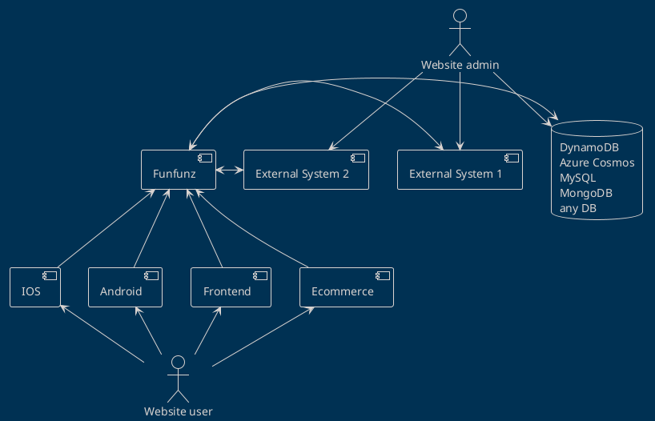
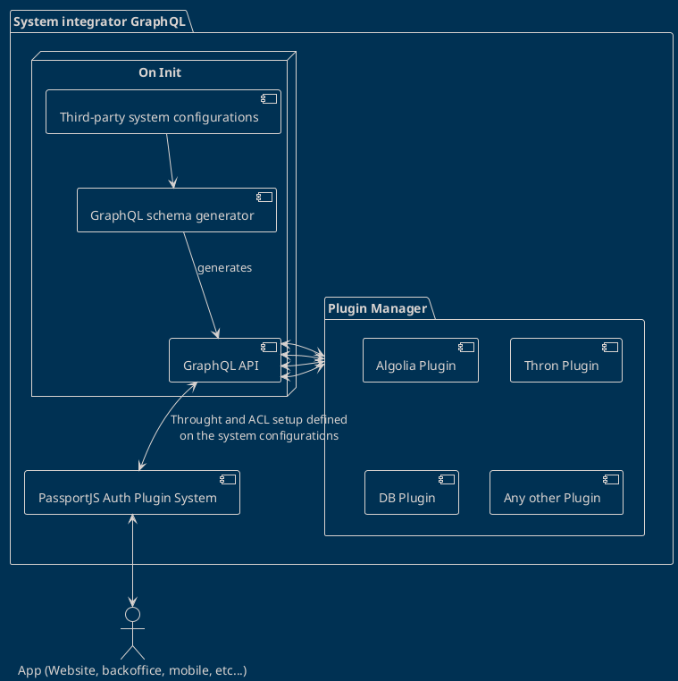

# Architecture

## Application overview

This diagram describes the main structure of the application. Funfunz is used has a system integrator that connects the multiple outer systems and creates a single GraphQL API that can be used by multiple different applications.



## Inner System Integrator Architecture

This diagram exemplifies the flow on the application start and usage. When the application starts, it reads from a set of configurations created previously and generates a GraphQL API based on that.

After that 



### Possible GraphQL queries

Asking for a specific **collection containing all colors->formats->finishes->thickness**

```graphql
{
  collection(uid: 123) {  // data from the database
    UID
    name
    colors {             // data from thron pim
      name
      images {           // data from thron dam
        url
        name
      }
      formats {          // data from thron pim
        size
        description
        label
        images {         // data from thron dam
          url
          name
        }
        finishes {       // data from thron pim
          description
          label
          images {       // data from thron dam
            url
            name
          }
          thickness {    // data from thron pim
            description
            label
            images {     // data from thron dam
              url
              name
            }
          }
        }
      }
    }
  }
}
```

The data source is entangled on the query, the front-end doesn't need to know where the data is coming from and is fully agnostic of the current data structure.

Mutations to this data can be allowed and will be possible to be done entirely through a single back-office, removing the necessity to use the multiple back-office applications. 

### Possible usage of Algolia indexer

Making a **random search with the string "123" and filtering for collections** only

```graphql
{
  algolia(query: 123, type: collection) {  // data from algolia
    UID
    name
    colors {             // data from thron pim
      name
      images {           // data from thron dam
        url
        name
      }
    }
  }
}
```

### We can also use Union types:

Define **different data structures based on the data** got from Algolia

```graphql
{
  algolia(query: 123) {  // data from algolia
    __typename
    ... on collection {  // data from thron pim
      UID
      name
    }
    ... on colors {      // data from thron pim
      name
      finishes {         // data from thron pim
          description
      }
    }
    ... on thickness {   // data from thron pim
      description
      label
      images {           // data from thron dam
        url
        name
      }
    }
  }
}
```

## Advantages:

- Only needs one time to develop the required plugin
- Plugins can be reused on multiple projects
- Can integrate multiple systems into a single GraphQL API
- Removes the need for the front-end to understand where the data is coming from
- Makes sure that the application integrating the GraphQL API needs only a single authentication system to access the data on the multiple systems
- Multiple access control lists can be create to filter/block/allow data for specific users or user groups
- Fully owned by the us
- Can run on any cloud service that supports NodeJS
- Can use any type of cashing system
- Can connect to any type of back-end
- Custom plugins can be developed for any requirement
- Would be the first company product
- Allows the front-end developers to focus on the front-end
- Creates a standard on the API integration level for both the front-end and back-end
- etc
- etc
- etc

On the long run this type of development will save time on the development, an by that, will also save money on the development and projects.