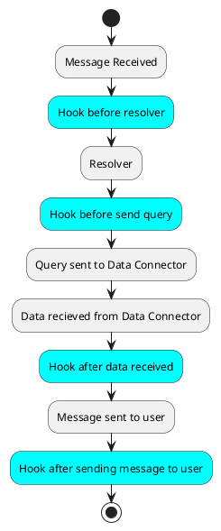

# Hooks

The Hook system exists to give flexibility to the developer to add more control over the life cycle of a GraphQL query.

## Life Cycle



## Hook types

When defining the model configuration, the developer can add custom functions to each of the above Hooks.

The hooks have been devided into operation types and hook type:

```js
OperationTypes = 'all' | 'config' | 'count' | 'add' | 'query' | 'update' | 'delete'
```

```js
HookTypes = 'beforeResolver' | 'beforeSendQuery' | 'afterQueryResult' | 'afterResultSent'
```

## Usage example

**Entity model**
```js
{
  name: string, // entity name
  connector: string, // user defined name of the connector set on the config file
  visible: boolean, // if this entity is visible on the API
  hooks: {
    [OperationType]: { // the type of operation to hook, one of the OperationTypes
      [HookType]: async (props: IHookProps<RequestContext>) { // the hook type, one of the HookTypes
        /*
         * ...
         * someCode
         * ...
         */
        return props // always return the props to continue the life cycle
      }
    }
  },
  ...
}
```

## IHookProps interface

```js
export interface IHookProps<RequestContext, U extends User = User> {
  graph: ExecuteGraphQL
  connector: DataConnector
  user: U
  args: IArgs
  query?: IQueryArgs | IUpdateArgs | ICreateArgs | IRemoveArgs
  results?: unknown
  context?: RequestContext 
}
```

- graph: a global instance of GraphQL that has super user access, this is good to check for user permissions for example.
- connector: the Data Connector instance for the requested entity.
- user: the current user information. Will be an empty unauthenticated user if no user is set in the GraphQL context.
- args: arguments passed during the query request.
- query: arguments parsed that will/was used by the connector. Also on the `beforeResolver` hook, this parse hasn't occured yet, so the value is `undefined.
- results: will contain the results from the Data Connector, only available on `afterQueryResult` and `afterResultSent`.
- context: this is an object created for each request that will contain context that can be used across multiple hooks on the same request.  